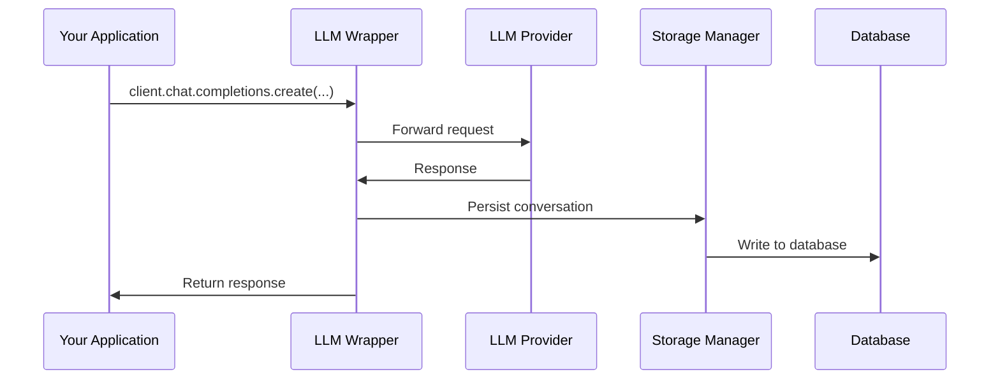
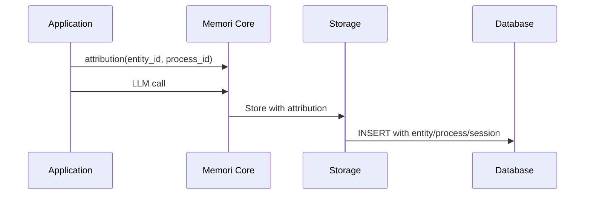
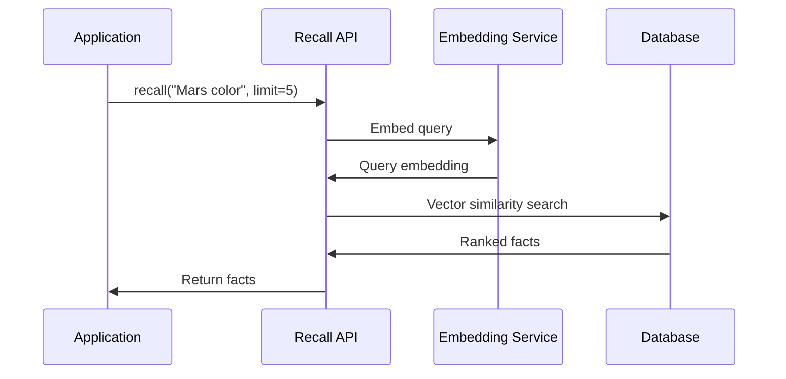
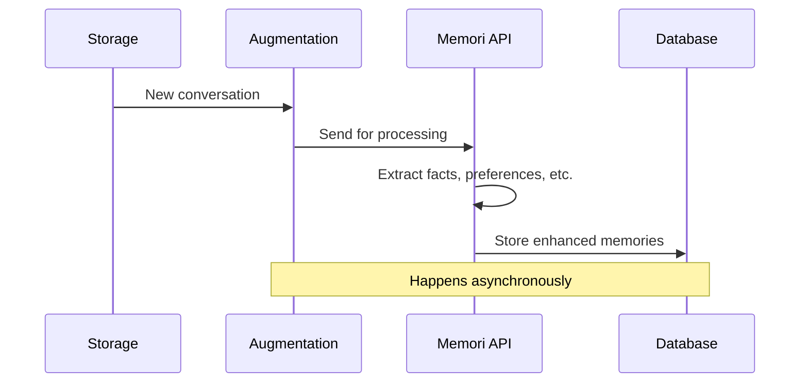

[](https://memorilabs.ai/)

# Architecture Overview

Memori is built with a modular, enterprise-grade architecture focused on simplicity, reliability, and flexible database integration.

## System Architecture

```
┌─────────────────────────────────────────┐
│ APPLICATION LAYER                       │
|                                         |
│  • Your code + LLM client               │
└──────────────┬──────────────────────────┘
               │
┌──────────────▼──────────────────────────┐
│ MEMORI CORE                             │
|                                         |
│  • LLM provider wrappers                │
│  • Attribution (entity/process/session) │
│  • Recall API                           │
└──────────────┬──────────────────────────┘
               │
┌──────────────▼──────────────────────────┐
│ STORAGE LAYER                           │
|                                         |
│  • Connection Registry                  │
|  • Schema Builder                       |
│  • Database Adapters                    │
|  • Database Drivers                     |
└──────────────┬──────────────────────────┘
               │
┌──────────────▼──────────────────────────┐
│ DATABASE AGNOSTIC STORAGE               │
└─────────────────────────────────────────┘
```

## Core Components

### 1. Memori Core

**Key Responsibilities:**
- Manage attribution (entity, process, session)
- Coordinate storage and Advanced Augmentation
- Provide LLM provider wrappers
- Expose recall API for semantic search

### 2. LLM Provider Wrappers

**How it works:**

- Intercepts LLM client method calls
- Captures user messages and AI responses
- Persists to database via storage manager
- Supports sync, async, streamed, and unstreamed modes
- Works with OpenAI, Anthropic, Google, xAI, LangChain, Pydantic AI

### 3. Attribution System

**Tracking Model:**
- **Entity**: Person, place, or thing (typically a user)
- **Process**: Agent, program, or workflow
- **Session**: Groups related LLM interactions

### 4. Storage System

**Supported Connections:**
- SQLAlchemy sessionmaker
- DB API 2.0 connections
- Django ORM connections
- MongoDB databases

### 5. Advanced Augmentation

**What it does:**
- Extracts facts from conversations
- Generates embeddings for semantic search
- Identifies preferences, skills, attributes
- Runs asynchronously with no latency impact
- Upgrade via `memori login` or MEMORI_API_KEY (free tier available)

## Data Flow

### 1. Conversation Capture



### 2. Attribution Tracking



### 3. Recall API Flow



### 4. Advanced Augmentation



## Configuration

### Environment Variables

```bash
# Memori API key for Advanced Augmentation
export MEMORI_API_KEY="your-api-key"
```
