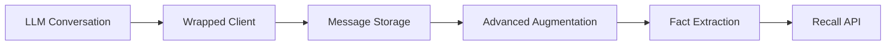

[](https://memorilabs.ai/)

# Basic Usage

Learn the core concepts of Memori with practical examples.

## Core Concepts

### Suggested Setup (Optional)

To make sure everything is installed in the most efficient manner, we suggest you execute the following one time, after you install Memori:

```bash
memori setup
```

This step is not necessary but will prep your environment for faster execution. If you do not perform this step, it will be executed the first time Memori is run which will cause the first execution (and only the first one) to be a little slower.

### Configure Your Database

1. Run this command once, via CI/CD or anytime you update Memori.

    ```python
    Memori(conn=db_session_factory).config.storage.build()
    ```

2. Instantiate Memori with the connection factory.

    ```python
    from memori import Memori
    from openai import OpenAI

    client = OpenAI(...)
    mem = Memori(conn=db_session_factory).llm.register(client)
    ```

### Attribution System

Memori tracks memories across three dimensions:

- **Entity ID**: Who (person, place, or thing; like a user)
- **Process ID**: What (your agent, LLM interaction, or program)
- **Session ID**: When (conversation group, auto-managed)

### Augmentation Types

Background AI extracts structured information:

| Type            | Purpose                  | Example                          |
| --------------- | ------------------------ | -------------------------------- |
| **Facts**       | Objective information    | "I use PostgreSQL for databases" |
| **Preferences** | User choices             | "I prefer clean, readable code"  |
| **Skills**      | Abilities & knowledge    | "Experienced with FastAPI"       |
| **Rules**       | Constraints & guidelines | "Always write tests first"       |
| **Events**      | Important occurrences    | "Launched product on Nov 15"     |

### How It Works



1. **Client Wrapping**: LLM client wrapped with `.register()`
2. **Message Storage**: Conversations stored with attribution
3. **Advanced Augmentation**: AI extracts facts asynchronously
4. **Recall API**: Semantic search using embeddings

### Example

```python
import os
import sqlite3

from memori import Memori
from openai import OpenAI


def get_sqlite_connection():
    return sqlite3.connect("memori.db")


client = OpenAI(api_key=os.getenv("OPENAI_API_KEY"))

memori = Memori(conn=get_sqlite_connection).llm.register(client)
memori.attribution(entity_id="123456", process_id="test-ai-agent")
memori.config.storage.build()

response = client.chat.completions.create(
    model="gpt-4.1-mini",
    messages=[
        {"role": "user", "content": "My favorite color is blue."}
    ]
)
print(response.choices[0].message.content + "\n")

# Advanced Augmentation runs asynchronously to efficiently
# create memories. For this example, a short lived command
# line program, we need to wait for it to finish.

memori.augmentation.wait()

# Memori stored that your favorite color is blue in SQLite.
# Now reset everything so there's no prior context.

client = OpenAI(api_key=os.getenv("OPENAI_API_KEY"))

memori = Memori(conn=get_sqlite_connection).llm.register(client)
memori.attribution(entity_id="123456", process_id="test-ai-agent")

response = client.chat.completions.create(
    model="gpt-4.1-mini",
    messages=[
        {"role": "user", "content": "What's my favorite color?"}
    ]
)
print(response.choices[0].message.content + "\n")
```

## Recall

1. **Automatic Recall** (Default) - Memories are automatically used during conversations
2. **Manual Recall** (Optional) - Explicit memory retrieval using the recall API

### Automatic Recall

By default, Memori enhances conversations automatically by intercepting outbound calls to the LLM and enhancing them with context.

### Manual Recall (Optional)

Use the recall API when you need explicit memory retrieval.

**Use manual recall when you need to:**

- Build custom context for prompts
- Display memories to users in a UI
- Debug what the system has learned
- Filter memories by specific criteria
- Integrate memories into non-LLM workflows

### Key Differences

| Aspect            | Automatic Recall        | Manual Recall                |
| ----------------- | ----------------------- | ---------------------------- |
| **Trigger**       | Happens automatically   | Explicit `mem.recall()` call |
| **Use Case**      | Natural conversations   | Custom workflows, UI display |
| **Code Required** | None (default behavior) | `mem.recall(query, limit)`   |
| **When to Use**   | Most applications       | Debugging, custom context    |
| **Performance**   | Optimized by Memori     | On-demand, as needed         |

> **💡 Best Practice:** Let automatic recall handle conversations naturally. Use manual recall only when you need explicit memory access for custom features or debugging.

## Attribution System

### Setting Attribution

```python
# Set who and what is creating memories
mem.attribution(
    entity_id="user_123",      # Person, place, thing; like a user
    process_id="chatbot_v2"    # You agent, LLM interaction, or program
)
# session_id is auto-generated and managed
```

### Session Management

```python
# Get current session
current_session = mem.config.session_id

# Start new session (new conversation group)
mem.new_session()

# Set specific session
mem.set_session("previous-session-id")
```

# Recall API

### Semantic Search

```python
# Search for relevant facts
facts = mem.recall("What are my coding preferences?", limit=5)

for fact in facts:
    print(f"Fact: {fact['content']}")
    print(f"Similarity: {fact['similarity']:.4f}")
    print(f"Created: {fact['created_at']}")
```

### How Recall Works

1. Query is embedded using all-mpnet-base-v2
2. Vector similarity search across fact embeddings
3. Results ranked by cosine similarity
4. Returns top N most relevant facts
