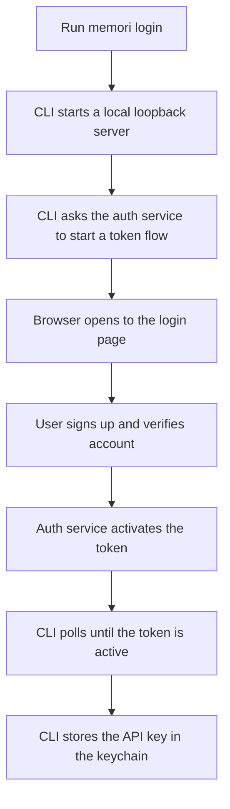

# Memori Auth Onboarding: Modal-Inspired Design and Implementation

This document is written as a narrative for product and engineering leadership. It explains:
- The problem Memori needs to solve (auth friction).
- Why Modal's onboarding flow is the inspiration.
- The solution Memori implemented in this repo.
- The exact mechanics, differences, and test coverage.

Sources:
- Modal v1.3.0.post1 CLI help and installed source (/opt/homebrew/lib/python3.11/site-packages).
- modal_proto/api.proto.
- Memori implementation in this repo (memori/cli.py, memori/_token_flow.py).
- Local auth simulator used for smoke testing.

Note: Modal behavior is documented from code and CLI output; a real Modal browser login was not completed.

## 1) The problem we are solving

Developer adoption drops when the first action after installation is a manual API key copy/paste. It creates friction, makes the product feel "unfinished," and delays the moment of value. We want Memori's first minute to feel like a polished SaaS onboarding: install, run one command, authenticate, and go.

## 2) The inspiration: how Modal does it

Modal solved this with `modal setup`, which launches a browser flow, then the CLI waits for the backend to confirm completion. The CLI never receives the token directly from the browser, which allows the backend to gate activation on signup, verification, or policy checks. This is both polished and secure.

## 3) The Memori solution (high-level)

Memori mirrors the same token flow pattern:
- The CLI starts a loopback server on localhost.
- The CLI requests a token flow from the backend.
- The browser opens to a login page.
- The user completes signup/verification.
- The backend activates the token.
- The CLI polls until activation and then stores the key in the OS keychain.

## 4) Diagram: End-to-End Token Flow

## 5) Memori implementation details (current)

### CLI behavior
- Command: `memori login` (entry point via `pyproject.toml`).
- Starts a loopback HTTP server on 127.0.0.1 and returns `token_flow_id` when ready.
- Opens the browser to the returned `web_url` or builds a URL from `--login-url`.
- Polls the auth service until the flow is active, then stores the API key in the OS keychain.

### Token flow endpoints (REST)
- `POST /v1/token-flow/create` with `{localhost_port, next_url, utm_source}`.
- `POST /v1/token-flow/wait` with `{token_flow_id, wait_secret, timeout}`.
- Expected wait response fields: `api_key` (or `token`/`token_secret` fallback), `email`, `timeout`.

### Loopback server behavior
- Implemented with `http.server.HTTPServer` (stdlib).
- Returns 503 "pending" until the token flow id is created, then responds with the id.
- Adds CORS `Access-Control-Allow-Origin: *` for browser access.

### Login URL composition
- Default login URL: `https://memorilabs.ai/login`.
- `memori login` adds `token_flow_id`, optional `code`, and `source=cli` as query params when it constructs the URL.

### Storage and status
- Credentials are stored in the system keychain via `keyring` (`memori/_auth.py`).
- `memori status` reports keychain vs env usage; `MEMORI_API_KEY` overrides keychain.

### Defaults and env overrides
- Auth base: `MEMORI_AUTH_BASE` or `MEMORI_API_URL_BASE` (default `https://api.memorilabs.ai`).
- Login URL: `MEMORI_LOGIN_URL` (default `https://memorilabs.ai/login`).
- Loopback port: `MEMORI_LOGIN_PORT` (default 54321, fallback to random if busy).
- Per-poll timeout: `MEMORI_LOGIN_WAIT_TIMEOUT` (default 40s).
- Post-auth redirect: `MEMORI_LOGIN_NEXT_URL` (default `/home`).

## 6) Modal reference flow (condensed)

### Token flow protocol (gRPC)
- `TokenFlowCreateRequest` fields: `utm_source`, `localhost_port`, `next_url`.
- `TokenFlowCreateResponse` fields: `token_flow_id`, `web_url`, `code`, `wait_secret`.
- `TokenFlowWaitRequest` fields: `timeout`, `token_flow_id`, `wait_secret`.
- `TokenFlowWaitResponse` fields: `token_id`, `token_secret`, `timeout`, `workspace_username`.
- The CLI polls `TokenFlowWait` forever until `timeout == false`.

### Loopback server
- Uses `aiohttp.web` bound to 127.0.0.1 on a random port.
- The `/` handler returns the `token_flow_id` with CORS enabled.

### Token verification and storage
- After wait returns, the CLI verifies the token via `ClientHello`.
- Tokens are stored in plaintext at `~/.modal.toml`.

## 7) Differences vs Modal (and why they matter)

| Area | Modal | Memori | Impact |
| --- | --- | --- | --- |
| Transport | gRPC | REST | Easier to integrate with existing web stack. |
| Storage | Plaintext config | OS keychain | Better security posture. |
| Token verification | `ClientHello` after auth | None yet | Could add verification for extra safety. |
| Profiles | Multiple profiles | Single keychain entry | Simpler UX, less flexibility. |

## 8) Signup and verification gating

In both flows, the CLI never receives tokens directly from the browser. The backend activates the token only after signup and verification are completed. The CLI simply polls until the backend marks the token active. This allows us to enforce any verification or policy checks without changing the CLI.

## 9) Local auth simulator and smoke test

Because the backend service is out of scope for this repo, we use a local simulator to validate the flow:
- `scripts/auth_sim_server.py` implements the create/wait/activate endpoints in memory.
- `scripts/auth_sim_login.html` is a static login page with an "Activate token" button.
- `scripts/smoke_memori_auth.sh` runs `memori login` against the simulator and validates login, status, logout, quota messaging, and the SDK auth nudge.

## 10) Gaps and next steps

- Add an optional token verification step (Modal-style) after `token-flow/wait` returns.
- Decide whether to introduce profiles or remain single-credential.
- Finalize backend token-flow endpoints and ensure they match the CLI contract.
